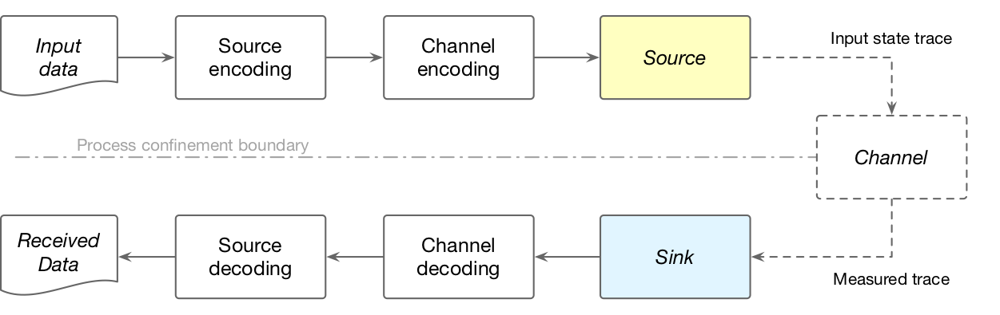
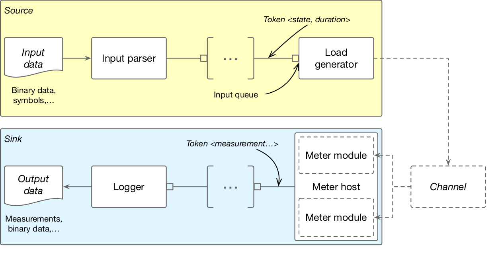

[:back:](/home)
---

# The core framework

## Design

The design of the application library and the core framework is motivated by the typical channel model found in the area of data leak research, shown below.

The library implements a subset of the *process network* model of computation, and allows combining the different components of the channel model into linear process networks. One possible realisation of a channel is shown below.

> *NOTE:* For further information about the library's design considerations please refer to the [white paper](http://pub.tik.ee.ethz.ch/people/miedlp/2020-05-22_ExOT_Whitepaper.pdf).

## Implementation

The [core framework](https://gitlab.ethz.ch/tec/public/exot/app_lib/blob/master/include/exot/framework) of the library provides the building blocks necessary for using the *process network* model:

1. **Nodes**: Components that encapsulate reading/writing interfaces and contain the executable processes of the network. The definition of the node classes for token producers, consumers, and processors are available in [framework/node.h](https://gitlab.ethz.ch/tec/public/exot/app_lib/blob/master/include/exot/framework/node.h).
2. **Interfaces**: Abstractions of the underlying communication mechanism that enforce the formalism of the *process network* MoC. These are defined in [framework/interface.h](https://gitlab.ethz.ch/tec/public/exot/app_lib/blob/master/include/exot/framework/interface.h).
3. **Queues**: Queues are the primary containers through which the process network nodes communicate. The library provides, in [framework/queue.h](https://gitlab.ethz.ch/tec/public/exot/app_lib/blob/master/include/exot/framework/queue.h), a thread-safe `LockingQueue` template as well as a `TimeoutLockingQueue`, which defines extended queue access semantics (with methods like *try_read* and *try_write_for*) that can "circumvent" traditional blocking reads and writes. These are available at [framework/queue.h](https://gitlab.ethz.ch/tec/public/exot/app_lib/blob/master/include/exot/framework/queue.h).
4. **Connectors**: High level utilities that connect nodes together, verify their compatibility and create the necessary queues. The connector template functor and functions are available at [framework/connect.h](https://gitlab.ethz.ch/tec/public/exot/app_lib/blob/master/include/exot/framework/connect.h).
5. **Executors**: Utilities, provided in [framework/executor.h](https://gitlab.ethz.ch/tec/public/exot/app_lib/blob/master/include/exot/framework/executor.h), that facilitate executing the nodes' processes on system and user-space threads.
6. **State**: Lastly, the framework provides a simple way of holding local and global [state](https://gitlab.ethz.ch/tec/public/exot/app_lib/blob/master/include/exot/framework/state.h), with thread-safe access and a Unix signal interface.
