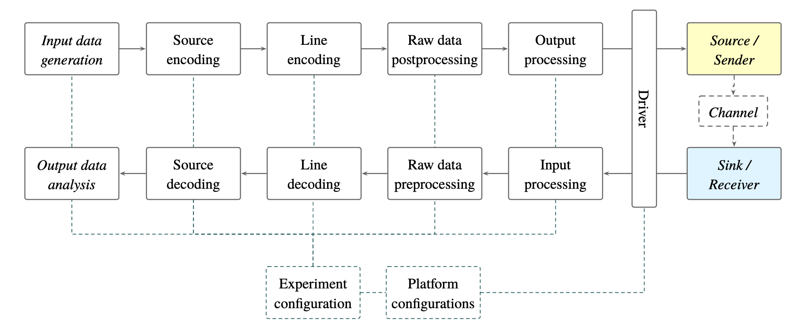
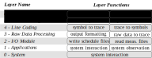

[:back:](/home)
---

The diagram below shows the general structure of a covert channel evaluation experiment. The Data Processing Framework targets all elements of the experimental flow, except for the sender and receiver applications, which are built on top of the Application Library.

[Layer example](https://gitlab.ethz.ch/tec/public/exot/eengine/-/blob/master/notebooks/examples/layer_lne.ipynb)