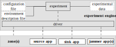

[:back:](/home)
---

# ExOT Experiment Ecosystem

The figure below illustrates the structure of an experiment setup with ExOT:

In this page, we will describe the different components and their purpose:

## Experiment Engine

### Experiment

### Configuration file

### Environment description file

### Experiment data

### Driver

## Experiment Environment

The experiment environment is defined in the descriptor files in the [./desc]() directory.
It can consist of one or multiple zones.
Each zone defines a (physical or virtual) machine.
During the experiment, the different applications are launched in the respective zones, defined in the descriptor files.
The machines used in an environment have to comply to following demands from the framework:
* Root access to the framework 
* Be able to run the respective applications.
* TODO shell emulators (screen tmux) - driver constraints

### Zone(s)

### Source app

### Sink app

### Jammer app(s)

## Experiment Host
The experiment host runs the experiment engine, and needs a checkout of the [eengine repository](https://gitlab.ethz.ch/tec/public/exot/eengine) and the required packets.
It also saves all the experiment data, a machine with a high amount of memory is therefore preferable.
Furthermore, for the analysis high computing resources might be required.
Different steps of an experiment can also be executed on different experiment hosts. 

## Backup
The Backup machine is simply a longterm storage for the experiment data.
This feature has not yet been fully implemented in the eengine.
