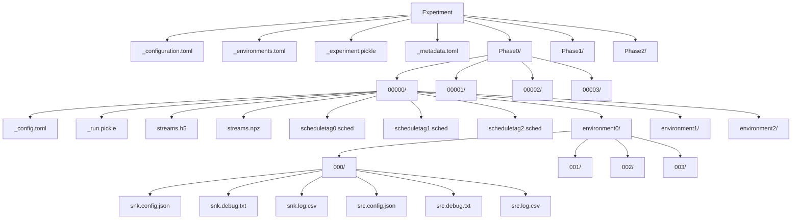

[:back:](/home)
---

# ExOT Experiment Ecosystem

The experiment engine is an integral part o the ExOT experiment ecosystem.
Therefore, this page illustrates the interaction of the different parts of the ecosystem to make understanding of the eengine functionality easier.
The figure below illustrates the structure of the ExOT experiment ecosystem:

In the remainder of the page, we describe these components and the ones that are not visible in this blockdiagram, but which are nonetheless important.

## Poetry python environment
Using the ExOT eengine requires a fitting python environment is necessary.
To simplify its setup and make the python environment versionable, ExOT relies on [poetry](https://python-poetry.org/) for python packet management.
Poetry can easily be used with python version environments, such as [pyenv](https://github.com/pyenv/pyenv).
Please follow the instructions for setting up [poetry](https://python-poetry.org/docs/#installation) and [pyenv](https://github.com/pyenv/pyenv#installation) (or your python version management of choice) to setup the ExOT python environment.
The developers of ExOT used a `pyenv` environment called `toolkit` to contain the ExOT python packets.

## Experiment Engine
The experiment engine (eengine) is implemented in python 3.7 and contains all necessary functionality to generate, execute and analyse experiments, as well as standalone utilities.

### Experiment
The core component of the ExOT experiment ecosystem is the experiment class. 
This class provides the main interface for the streamlined experiment generation, execution and analysis process, as well as access to all relevant sub-components.
There are different types of experiments, which are described in detail in the [experiment types page](./experiment-types).

### Configuration file
The configuration file, by default situated in the `eengine/configurations/` directory, contains all relevant information regarding an experiment.
This file is used to define and version all experiment parameters.
For detailed information, please refer to the [dedicated wiki page](./experiment-configuration).

### Environment description file
The environment description file, by default situated in the `eengine/environments/` directory, contains the parameters of an experiment execution environment.
An experiment execution environment can contain a single device, e.g. a laptop or smartphone, multiple configurable entities on a device, e.g. multiple virtual machines on a server, or multiple devices, e.g. a network of sensor nodes.
For detailed information, please refer to the [dedicated wiki page](./environment-description-file).

### Experiment data
The ExOT experiment engine saves all relevant data of an experiment in a single location, by default located in `eengine/data/`.
This experiment data directory contains a copy of the experiment configuration and environment descriptor files, as well as the serialised experiment pickle object and subdirectories for each phase.
Each phase contains directories for the different runs, which in itself contain a serialised run pickle object and numpy exports of the different signals/run parameters.
Each experiments consists of multiple experiment phases, and each phase contains at least one specific run to be executed.
The structure of an experiment directory is as follows:

The elements of the hierachy diagram above are described in the table below:

| Node                                                                 | Description |
| -------------------------------------------------------------------  | ----------- |
| `Experiment`                                                         | The experiment root directory. Its the same as the experiment name. |
| `_configuration.toml`                                                | The experiment configuration serialised when writing the experiment. *Might not* be the same as the configuration that was used to generate the expeirment, if parameters in the experiment object have been overwritten. |
| `_environments.toml`                                                 | Collection of all available environments, independet of the fact whether they are used or not. |
| `_experiment.pickle`                                                 | Pickle export of the experiment object. |
| `_metadata.toml`                                                     | File to track the condition of the git repository, to inform the user if the git repository was dirty when the experiment was generated. |
| `Phase0/`, `Phase1/`, `Phase2/`                                      | Directories containing the runs for each of the different phases. These directories are named according to the phase definition in the experiment configuration. |
| `00000/`, `00001/`, `00002/`, `00003/`                               | Run directories, identified as a 5 digit run ID. |
| `_config.toml`                                                       | Configuration of a single run, exported when the experiment was written. |
| `_run.pickle`                                                        | Pickle export of the run object. |
| `streams.h5`                                                         | All signal streams that are contained in the run. |
| `streams.npz`                                                        | All signal streams that are contained in the run. |
| `scheduletag0.sched`, `scheduletag1.sched`, `scheduletag2.sched`     | Schedules that are used as input for the source (generator/sending) applications. These are differentiated by environemnt zone schedule tag. |
| `environment0/`, `environment1/`, `environment2/`                    | Directory containing the measurements for each platform, named according to the environment name. |
| `000/`, `001/`, `002/`, `003/`                                       | Repetitions of one run execution in a specific environment. Each repetition is identified by a three digit number. |
| `snk.config.json`                                                    | JSON configuration for the sink (meter/receiver) application. |
| `snk.debug.txt`                                                      | Debug output of the sink (meter/receiver) application. |
| `snk.log.csv`                                                        | Measurements recorded by the sink (meter/receiver) application. |
| `src.config.json`                                                    | JSON configuration for the source (generator/sender) application. |
| `src.debug.txt`                                                      | Debug output of the source (generator/sender) application. |
| `src.log.csv`                                                        | Measurements recorded by, or status values of the source (generator/sender) application. |

### Driver
The driver is a special module of the experiment engine, and is used as an interface to the expeiment environment.
Simply speaking, it allows the expeirment engine to send commands and data to the different zones in the experiment environment, configure the applications, and fetch results.
For more detailed information, please refer to the [experiment driver page](./experiment-drivers).

## Experiment Environment

The experiment environment can consist of one or multiple zones, at least a source (generator/sender) and sink (meter/receiver) application.
Optionally, the experiment environment can also contain jammer applications, which are used to generate controlled interference during experiments.
Each application is assigned to a zone of the environemnt, wheras each zone can contain no up to all applications.
Each zone defines a (physical or virtual) machine.

### Zone(s)
The zone(s) are defined in the descriptor files in the `eengine/environments/` directory, for more detailed information please refer to the [environment descriptor file](./environment-description-file) page.
During the experiment, the different applications are launched in the respective zones, defined in the descriptor files.
The machines used in an environment have to comply to following demands from the framework:
* Access through a dedicated user or interface that conforms to the experiment engine driver.
* All necessary ExOT in the application directory specified in the environment descriptor file and other required applications available to the dedicated user.
* If required by the ExOT or jammer applications, `sudo` access rights for the dedicated ExOT user. 
* The capability to execute the required applications.
* Sufficient memory to store the measurements of all repetitions of one run.

### Source app
This application is in general a generator application, developed with the ExOT application library, but in case of an `app_exec` experiment it can also be any other application. 
Roughly speaking, the source app can be a sender in a communication channel or an application which needs to be characterized.

### Sink app
The sink app is used to observe system parameters, normally a meter application developed with the ExOT application library is used for this task.

### Jammer app(s)
Jammer applications are used to generate controlled interference during experiments.
ExOT allows to instrument any application for this task, self developed apps, apps developed with the ExOT app_lib, pre-installed apps, etc.

## Experiment Host
The experiment host runs the experiment engine, and needs a checkout of the [eengine repository](https://gitlab.ethz.ch/tec/public/exot/eengine) and the required packets.
It also saves all the experiment data, a machine with a high amount of memory is therefore preferable.
Furthermore, for the analysis high computing resources might be required.
Different steps of an experiment can also be executed on different experiment hosts. 

## Backup
The Backup machine is simply a longterm storage for the experiment data.
This feature has not yet been fully implemented in the eengine.
