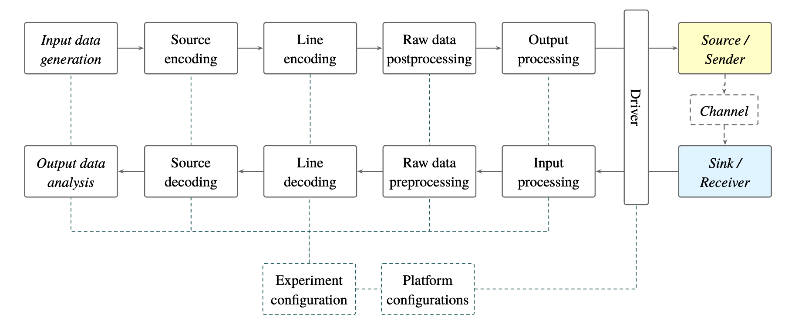

## Experiment Orchestration Toolkit

Welcome to the __Experiment Orchestration Toolkit__, short __ExOT__, knowledge base.
__ExOT__ was build to orchestrate experiments for the evaluation of covert channels in multicore systems (e.g. Thermal Covert Channel[^1], Power Covert Channel[^2], Frequency Covert Channel[^3]). The Toolkit has been [described in a recent paper](https://doi.org/10.3929/ethz-b-000377986) which will appear in the proceedings of “Design, Automation & Test in Europe Conference & Exhibition (DATE 2020), Grenoble, France, March 9-13, 2020”.

### Get started
In order to enjoy all features of ExOT, please follow the steps bellow to get a basic setup:

Make sure you have the following software installed:
1. python 3.7
1. poetry
1. Android Studio

Create an ExOT directory and clone all the ExOT repositories into this directory and initialise the submodules, using following script:
```bash
for repo in eengine app_unx app_apk compilation; do
  git clone https://gitlab.ethz.ch/tec/public/exot/${repo}.git
  cd ${repo}
  git checkout v1.1.0
  git submodule --init --recursive update
  cd ..
done
```
Setup the docker environment, using the instructions in the [README](https://gitlab.ethz.ch/tec/public/exot/compilation/blob/develop/README.md), to be able to compile deployment applications.

---

### Covert channel evaluation methodology

> TODO

### Software support

ExOT provides extended software support for the above-mentioned methodology. The toolkit consists of:

- The __Data Processing Framework__, which allows defining and conducting experiments for channel evaluation, capacity bound derivation, and real-life deployment tests. [→ *Link to repository.*](https://gitlab.ethz.ch/tec/research/exot/datapro)
- The __Application Library__, which facilitates the creation of sender and receiver applications on *nix-based systems, including Android. [→ *Link to repository.*](https://gitlab.ethz.ch/tec/research/exot/app_lib)

- Complete __Unix__ and __Android applications__, which interoperate well with the __Data Processing Framework__. *→  Links to [Unix](https://gitlab.ethz.ch/tec/research/exot/app_unx) and [Android](https://gitlab.ethz.ch/tec/research/exot/app_apk) application repositories.*

    > Compiled applications are also available for the _x86_64_ and _aarch64_ architectures in the [Application Scratch repository](https://gitlab.ethz.ch/tec/research/exot/app_scratch).

The diagram below shows the general structure of a covert channel evaluation experiment. The __Data Processing Framework__ targets all elements of the experimental flow, except for the sender and receiver applications, which are built on top of the __Application Library__.



#### Application Library

The **Application Library** provides the building blocks for creating applications that interoperate well with the rest of the ExOT. The following pages give an overview of the design of the library, describe how it can be used and what kind of facilities it provides.

1. [Overview, structure & terminology](1.-The-Application-Library/Framework-overview)
1. [Using the library in your project](1.-The-Application-Library/Using-the-library)
1. [Contributing to the library](1.-The-Application-Library/Contributing-to-the-library)
1. [The core framework design](1.-The-Application-Library/The-core-framework)
1. [Provided components](1.-The-Application-Library/Provided-components)
1. [Available metering modules](1.-The-Application-Library/Available-metering-modules)
1. [Platform specific primitives](1.-The-Application-Library/Platform-specific-primitives)
1. [Utilities](1.-The-Application-Library/Utilities)

The creation of applications powered by the **Application Library** can be made simpler and more reproducible with the help of the provided [Docker-based build environment](4.-How-to/Dockerised-build-environment). It also provides all the facilities required for cross-compilation.

A number of how-toʼs are relevant to the **Application Library**:

- [Creating metering modules](4.-How-to/Creating-metering-modules)
- [Creating process network components](4.-How-to/Creating-process-network-components)
- [Assembling metering modules](4.-How-to/Assembling-metering-modules)
- [Building applications](4.-How-to/Building-applications)

#### Applications

The following pages give an overview of all available applications and their usage.

- [Unix application index](2.-The-Applications/Application-Index)
- [Android application index](2.-The-Applications/Android-Application-Index)
- [Android Intent Proxy](2.-The-Applications/Android-Intent-Proxy)

#### Data Processing Framework

The structure and usage of the __Data Processing Framework__ is explained on the following pages.

1. [The ecosystem](3.-The-Data-Processing-Framework/The-Ecosystem)
1. [Information flow](3.-The-Data-Processing-Framework/Information-flow)
1. [Experiment structure](3.-The-Data-Processing-Framework/Experiment-structure)
1. [Experiment drivers](3.-The-Data-Processing-Framework/Experiment-drivers)
1. [Support library & utilities](3.-The-Data-Processing-Framework/Support-library)

#### How-toʼs

This section provides how-toʼs, examples, demos, etc. to make it easier to get started with ExOT.

- [Dockerised build environment](4.-How-to/Dockerised-build-environment)
- [Code style and formatting](4.-How-to/Code-style-and-formatting)


#### FAQ <- TODO

------
[^1]: Bartolini, D.B., Miedl, P. and Thiele, L., 2016, April. On the capacity of thermal covert channels in multicores. In Proceedings of the Eleventh European Conference on Computer Systems (p. 24). ACM.
[^2]: Miedl, P. and Thiele, L., 2018, April. The security risks of power measurements in multicores. In Proceedings of the 33rd Annual ACM Symposium on Applied Computing (pp. 1585-1592). ACM.
[^3]: Miedl, P., He, X., Meyer, M., Bartolini, D.B. and Thiele, L., 2018. Frequency Scaling as a Security Threat on Multicore Systems. IEEE Transactions on Computer-Aided Design of Integrated Circuits and Systems, 37(11), pp.2497-2508.
However, due to its flexible design, ExOT can orchestrate and conduct many kinds of different experiments, for example side channel explorations, benchmarking of applications or transmission protocols, etc.
