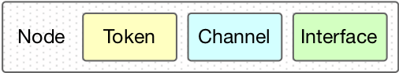
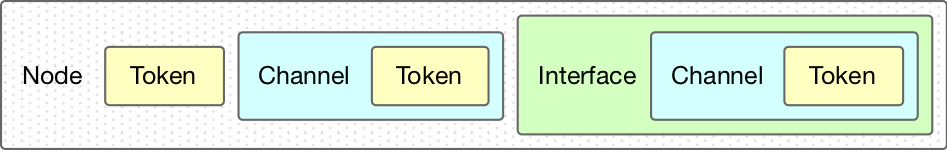

[:back:](/home)
---

# Creating process network components

The framework defines three classes of *process network* nodes:

1. **Consumers**: receiver nodes that only have an input interface, from which they *consume* tokens.
2. **Producers**: transmitter nodes that only have an output interface, to which the process writes tokens.
3. **Processors**: nodes that inherit from consumer and producer classes, and provide both input and output interfaces.

### Definitions

The interfaces are defined as:

1. Consumer. The input interface is available via a local member variable `in_`.
    ```c++
    template <typename Token, template <typename...> typename Container,
              template <typename, template <typename...> typename> typename Reader>
    class IConsumer : public virtual Node, public virtual TConsumer;
    ```
2. Producer. The output interface is available via a local member variable `out_`.
    ```c++
    template <typename Token, template <typename...> typename Container,
              template <typename, template <typename...> typename> typename Writer>
    class IProducer : public virtual Node, public virtual TProducer;
    ```
3. Processor. The input and output interfaces are available at `in_` and `out_`.
    ```c++
    template <typename InputToken, template <typename...> typename InputContainer,
              template <typename, template <typename...> typename> typename Reader,
              typename OutputToken, template <typename...> typename OutputContainer,
              template <typename, template <typename...> typename> typename Writer>
    class IProcessor : public IConsumer<InputToken, InputContainer, Reader>,
                       public IProducer<OutputToken, OutputContainer, Writer>,
                       public virtual TProcessor;
    ```

Seeing these class templates for the first time can be a bit intimidating. However, these essentially allow much simpler declarations afterwards.

The basic principle behind such a definition is that the template parameters are passed rightwards to subsequent parameters. Writing:



"Expands" it to:



Therefore, instead of writing:

```c++
class ConcreteConsumer : public IConsumer<int, queue<int>, interface<queue<int>>>;
```

We only need to write:

```c++
class ConcreteConsumer : public IConsumer<int, queue, interface>;
```

The framework provides, in [include/framework/all.h](https://gitlab.ethz.ch/tec/public/exot/app_lib/blob/master/include/exot/framework/all.h), useful template aliases:

```c++
/** Aliases for nodes using thread-based interfaces. */
template <typename InputToken>
using ThreadConsumer =
    IConsumer<InputToken, TimeoutLockingQueue, ExtendedQueueReader>;
template <typename OutputToken>
using ThreadProducer =
    IProducer<OutputToken, TimeoutLockingQueue, ExtendedQueueWriter>;
template <typename InputToken, typename OutputToken>
using ThreadProcessor =
    IProcessor<InputToken, TimeoutLockingQueue, ExtendedQueueReader,
               OutputToken, TimeoutLockingQueue, ExtendedQueueWriter>;

/** Aliases for basic node types. */
template <typename InputToken>
using Consumer = ThreadConsumer<InputToken>;
template <typename OutputToken>
using Producer = ThreadProducer<OutputToken>;
template <typename InputToken, typename OutputToken>
using Processor = ThreadProcessor<InputToken, OutputToken>;

```

Therefore, for the common combinations of queues and interfaces, we only need to be concerned with the input/output tokens. The declaration from above will turn into:

```c++
class ConcreteConsumer : public Consumer<int>;
```

### Creating process network components

In the framework it is common to configure the components in the [same way as meter modules](how_tos/creating-meter-modules), i.e. declaring member *settings* classes, and a static *configure* function.

To have a *process network* node usable with the executors, it should inherit from the `IProcess` class, and implement the pure virtual function `void process()`.

The following example shows how to create a component that prints a random integer every time unit.

First, define a new class and declare aliases:

```c++
class RandomProducer : public IProcess, public Producer<int> {
    using node_type = Producer<int>;
    using token_type = typename node_type::interface_type::value_type;
```

Then, declare *settings* and the *configure* function:

```c++
    struct settings {
        std::chrono::milliseconds period{100};
    }

    static clipp::group configure(settings &s) {
        using namespace clipp;
        auto config = group{};
        config.push_back((option("-t", "--period") &
                 integer("period").call([&](const char *tmp) {
                   auto period = std::stoul(tmp);
                   period = period > 0 ? period : 100;
                   conf.period = std::chrono::milliseconds{period};
                 }))
                    .doc(fmt::format(
                        "set period in {}, default: [{}]",
                        covert::utilities::duration_unit(conf.period),
                        covert::utilities::duration_to_string(conf.period))));
        return config;
    }
```

The *process* function creates a random device and defines the action and stopping predicate for the timer function.

```c++
    void process() override {
        std::random_device rd;
        std::mt19937 rdg(rd());

        auto until = [this]() { return !global_state_->is_stopped(); };
        auto action = [this]() {
            out_.write(static_cast<int>(rdg()));
        };

        timer_.run_every(conf_.period, until, action);
    }
```
